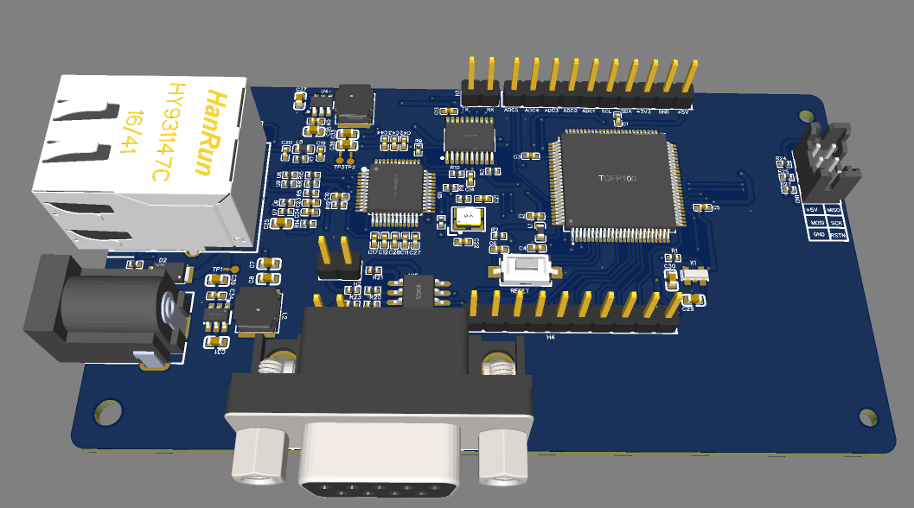
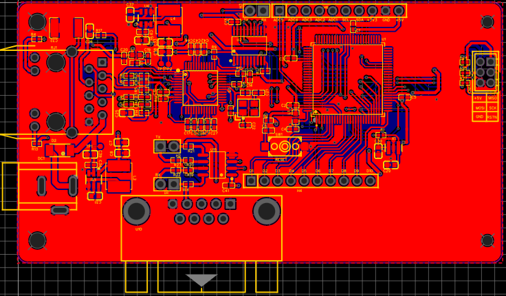
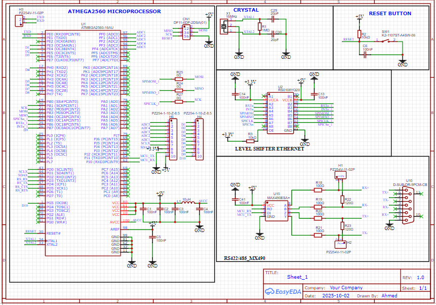
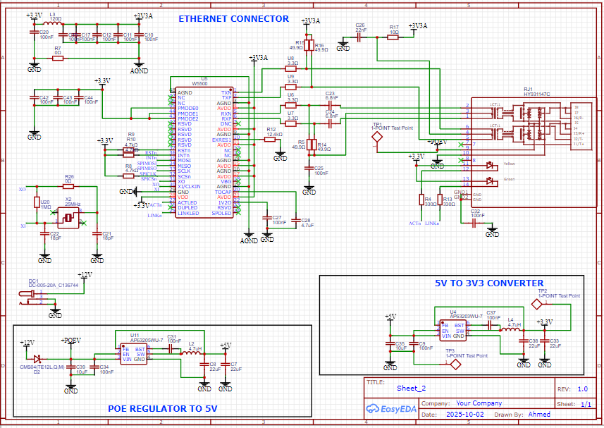

# ATmega2560 Industrial Ethernet & RS485 Gateway

## Description
This project is an industrial-grade communication controller based on the **ATmega2560** microprocessor. It serves as a robust bridge between Ethernet networks and industrial serial protocols, specifically designed for long-distance data transmission and networking in demanding environments.

## Key Features
* **Microcontroller:** ATmega2560-16AU (Arduino Mega compatible).
* **Ethernet Connectivity:** Integrated **Wiznet W5500** controller for high-speed wired networking.
* **Industrial Serial:** Onboard **MAX490** for reliable RS422/RS485 communication.
* **Power over Ethernet (PoE):** Dedicated **AP63205WU-7** based regulator circuit to power the board directly via LAN.
* **Voltage Regulation:** Multi-stage power design including **12V to 5V** and **5V to 3.3V** conversion.

---

## Project Gallery

### 1. 3D Preview

### 2. PCB Layout
#### Top Layer

#### Bottom Layer

### 3. Schematic Design
#### MCU & Industrial Serial (RS485)

#### Ethernet, PoE & Power Systems

---

## Hardware Component Specifications
* **Main MCU:** ATmega2560-16AU.
* **Ethernet Chip:** Wiznet W5500.
* **Serial Interface:** MAX490ESA+.
* **PoE Buck Converter:** AP63205WU-7.
* **Crystal:** 16MHz for MCU and 25MHz for Ethernet.
